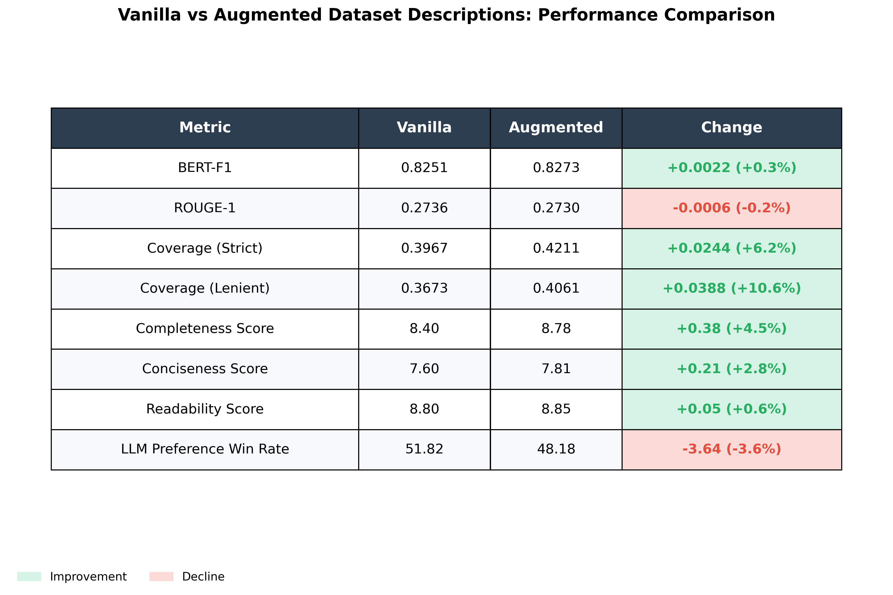

# PaperTrail 🔬📊

**Retrieval-Augmented Dataset Description Generation**

A fork of [AutoDDG](https://github.com/VIDA-NYU/AutoDDG) that enhances dataset descriptions by incorporating contextual information from citing research papers.

## 🎯 Motivation

Standard dataset descriptions generated from data profiles alone often miss crucial context about:
- How the dataset was collected
- What research questions it addresses
- Known limitations and biases
- Real-world usage patterns

**PaperTrail solves this** by analyzing research papers that cite the dataset and incorporating their insights into the final description.

## 🆕 What's New in PaperTrail

### Core Addition: Related Work Profiler

We introduce a new `RelatedWorkProfiler` class that:

1. **Extracts text from research PDFs** citing your dataset
2. **Intelligently locates relevant sections** using keyword-based search
3. **Generates a research-informed profile** describing the dataset's context, usage, and characteristics

### Enhanced Pipeline
```python
from autoddg import AutoDDG
import openai

client = openai.OpenAI(api_key="sk-...")
pipeline = AutoDDG(client=client, model_name="gpt-4o")

# NEW: Analyze related research papers
related_profile = pipeline.analyze_related(
    pdf_path="research_paper.pdf",
    dataset_name="My Dataset"
)

# Generate enriched description
prompt, description = pipeline.describe_dataset(
    dataset_sample=csv_sample,
    dataset_profile=profile,
    semantic_profile=semantic,
    related_profile=related_profile,  # ← NEW parameter
    use_related_profile=True,  # ← NEW parameter
    use_profile=True,
    use_semantic_profile=True
)
```

## 📊 Results

### Experiment Design

To validate PaperTrail's approach, we conducted a controlled experiment:
- **10 datasets** from Zenodo spanning multiple scientific domains
- **10 research papers** that cite these datasets (one per dataset)
- **Two conditions**: Vanilla AutoDDG vs. PaperTrail with research augmentation

**Evaluation pipeline:**
- Description generation: `prompt-experiments/experiment_runner.ipynb`
- Metric computation: `prompt-experiments/metric_test.ipynb`

### Main Findings

**Coverage improves significantly** when incorporating research context:
- **Lenient Coverage**: +10.6% (0.3673 → 0.4061) ⭐ *our primary metric*
- **Strict Coverage**: +6.2% (0.3967 → 0.4211)

This confirms our core hypothesis: research papers contain valuable information about dataset characteristics that isn't captured by data profiling alone.

**Description quality improves across most dimensions:**
- **Completeness**: +4.5% (8.40 → 8.78)
- **Conciseness**: +2.8% (7.60 → 7.81)
- **Readability**: +0.6% (8.80 → 8.85)
- **BERT-F1**: +0.3% (0.8251 → 0.8273)

**Slight variation in subjective preferences:**
- LLM Preference Win Rate shows a small decrease (-3.6%, 51.82% → 48.18%)
- ROUGE-1 remains essentially unchanged (-0.2%)

This suggests the augmented descriptions may use different stylistic conventions or introduce novel information that diverges from reference descriptions, though objective quality metrics consistently improve.


*Figure 1: Comparison of vanilla AutoDDG vs. PaperTrail across eight evaluation metrics. Green indicates improvement, red indicates decline.*

### What This Means

PaperTrail successfully enriches dataset descriptions with contextual information from research literature, **improving information coverage by over 10%** without sacrificing readability. The approach is particularly valuable for datasets with published research, where understanding the dataset's scientific context—such as collection methodology, intended use cases, and known limitations—matters for discoverability and reuse.

The consistent improvements in coverage and completeness demonstrate that research papers provide complementary information to what can be extracted from data profiles alone. While some stylistic differences emerge (as reflected in LLM preference scores), the substantial gains in information content make PaperTrail a compelling enhancement to standard dataset description generation.

## 🔧 Implementation Details

### Added Files
- `autoddg/related/related.py` - Core `RelatedWorkProfiler` class
- Updated `autoddg/main.py` - Added `analyze_related()` method
- Updated `prompts.yaml` - Added `related_work_instruction` template

### Key Features of RelatedWorkProfiler

**Intelligent Section Identification:**
```python
# Removes reference sections to avoid confusion
paper_text = profiler.remove_references_section(paper_text)

# Finds chunks mentioning the dataset
anchor_chunks = profiler.find_anchor_chunks(
    chunks=chunks,
    dataset_name="FluPRINT",
    min_tokens_to_match=2
)
```

**Flexible Search Strategies:**
- Keyword-based (fast, cost-effective)
- LLM-based relevance scoring 


### Limitations and Future Work

- **Requires citing papers**: PaperTrail's approach depends on having research papers that cite the dataset. For newly released datasets without publications, the system falls back to vanilla AutoDDG.
- **Paper quality matters**: The quality of extracted profiles depends on how thoroughly the citing paper describes the dataset.
- **Computational cost**: Adding PDF extraction and LLM-based profiling increases generation time and API costs.


## 📝 Citation

**Original AutoDDG paper:**
```bibtex
@misc{2502.01050,
Author = {Haoxiang Zhang and Yurong Liu and Wei-Lun Hung and Aécio Santos and Juliana Freire},
Title = {AutoDDG: Automated Dataset Description Generation using Large Language Models},
Year = {2025},
Eprint = {arXiv:2502.01050},
}
```

## License

`AutoDDG` is released under the [Apache License 2.0](./LICENSE).
